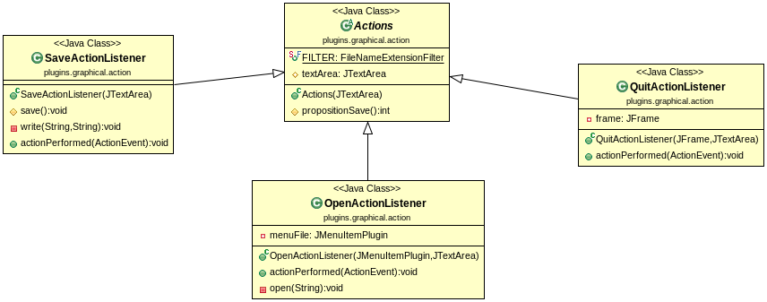

**Author**: *DIALLO Mamadou & FUNGWA MOKE Junior*
-------------------------------------------------

**PROJECT**: *Plugins*
------------------------

*Présentation des Objectifs du projet*
--------------------------------------

Ce projet consiste à réaliser un mini-éditeur de text dans le quel nous avons mis en oeuvre toutes les théories vu en cours et en TD notament le designe paterne `Observer`. 

*Récuperer le projet*
---------------------

Taper la commande :
		 
		git clone https://gitlab-etu.fil.univ-lille1.fr/diallom/diallo-fungwa-coo-tp0.git

Puis placez vous à la racine du projet pour la suite `TP_plugins`.

Compiler et exécuter le projet avec le `Makefile` mise en place
---------------------------------------------------------------

* **make comp**  : Pour compiler le projet.
* **make doc**   : Pour générer la documentation.
* **make**       : Pour faire les deux en même temps.
* **make plugin**  : Pour exécute le jar.<
* **make clean** : Pour supprime tout ce que l'on a produit précedement.

*Compiler le projet manuellement* 
---------------------------------

Pour  compiler le projet, depuis la racine du projet éxecuter la commande:
		
			“mvn package”

*Générer La Documentation*
--------------------------

Pour  générer la documentation  de toutes les classes, depuis la racine du projet éxecuter la commande:
		
			“mvn javadoc:javadoc”

Pour visualiser la documentation placez vous dans le répertoire **target/docs** .

**NB** : Le plugin donné sur le semainier ne fonctionnait pas chez nous, nous avons trouvé un autre en ligne pour l'inserer dans le *pom.xml* si vous rencontrez le même problème vous pouvez consulter le *pom.xml* pour decommenter l'un et commenter l'autre.

*Produire l'archive exécutable et l'exécuter*
---------------------------------------------

Avec la commande **mvn package** l'exécutable est automatiquement produit et pour l'exécuter taper les commandes suivantes:

* Pour la version textuelle:

			“java -jar target/TP_plugins-1.0-SNAPSHOT.jar ”

*Illustration de la coception faite avec les diagramme UML*
-----------------------------------------------------------

*************************************************************************************
* **La partie graphique** 
 

*************************************************************************************

*************************************************************************************
* **Les actions**

Les Differentes actions pour le menu `File` c'est à dire les `New` `Open` `Save` `Quit`.

*************************************************************************************
* **Une vue d'ensemble**

