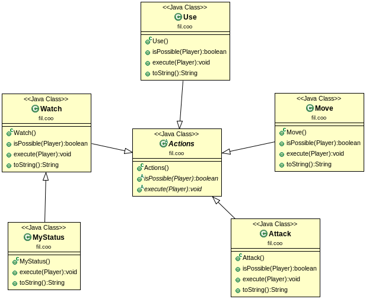
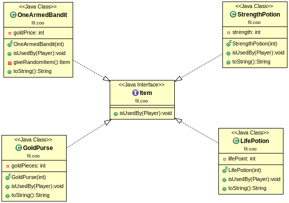
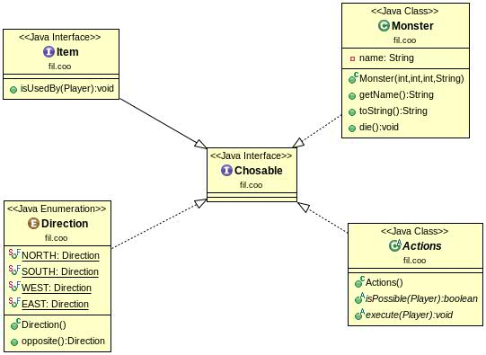
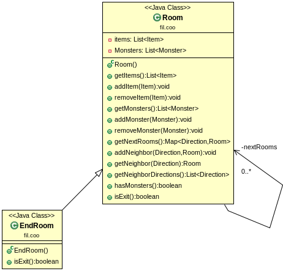
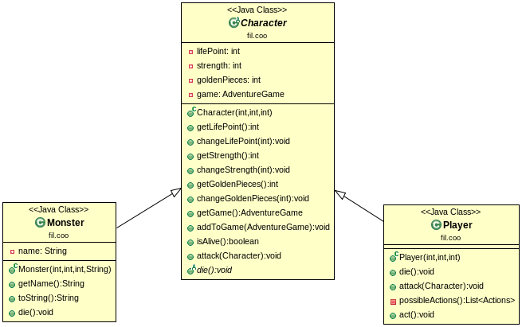
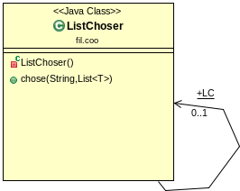
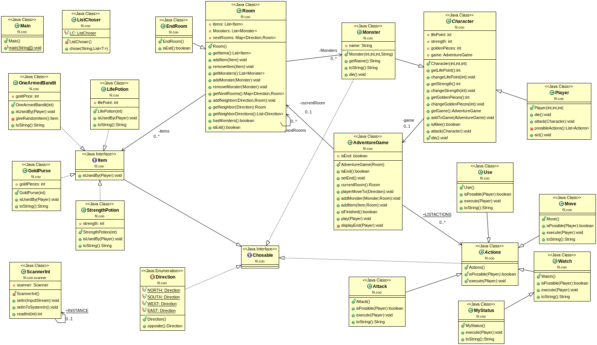

**Author**: *DIALLO Mamadou & FUNGWA MOKE Junior*
-------------------------------------------------

**PROJECT**: *Donjon*
---------------------

*Présentation et Objectifs du TP*
---------------------------------

Ce projet consite à réaliser une conception d'un jeux de donjon qui peut contenir plusieurs salles liées par de couloires, dans lesquelles peuvent se trouver differents monstres que le joueur doit obligatoirement tuer pour passer à une salle voisine et aussi differents objet qu'il pourra utiliser en cours soit pour augmenter ses points de vie, sa force ou ses pièces d'or. Pour finir le jeux il faudra arriver à la salle de fin donc la dernière, sans  oublier que après chaque attaque faite par le joueur le monstre attaqué peut riposter s'il n'est pas mort.

Pour réaliser cette conception nous avons utiliser differentes théories vues en cours à savoir l'Abstraction, le factoring de code en utilisant des interfaces voir des classes abstraites si necessaires et aussi une méthode générique qui régroupe tous les choix à faire dans le jeux, qui sont les actions à effectuer (attaquer,regarder,se deplacer,utiliser,revoir sa situation), les monstres à attaqués, la direction à prendre(au plus 4 directions possibles) pour se deplacer d'une salle à une autre et de l'objet à utiliser.

*Récuperer le projet*
---------------------

Taper la commande :
		 
		git clone https://gitlab-etu.fil.univ-lille1.fr/diallom/diallo-fungwa-coo-tp0.git
Puis placez vous à la racine du projet pour la suite.

*Compiler le projet*
--------------------

Pour  compiler le projet, depuis la racine du projet éxecuter la commande:
		
			“mvn package”

*Générer La Documentation*
--------------------------

Pour  générer la documentation  de toutes les classes, depuis la racine du projet éxecuter la commande:
		
			“mvn javadoc:javadoc”
Pour visualiser la documentation placez vous dans le répertoire **target/docs** .

**NB** : Le plugin donné sur le semainier ne fonctionnait pas chez nous nous avons trouvé un autre en ligne pour l'inserer dans le *pom.xml* si vous rencontrez le même problème vous pouvez consulter le *pom.xml* pour decommenter l'un et commenter l'autre.

*Produire l'archive exécutable et l'exécuter*
---------------------------------------------

Avec la commande **mvn package** l'exécutable est automatiquement produit et pour l'exécuter taper la commande 

			“java -jar target/TP_donjon-1.0-SNAPSHOT.jar”

**NB** : Pensez à taper la commande **mvn package** si celà n'a pas été fait avant.

*Explication de la coception faite*
-----------------------------------

*************************************************************************************
**Les actions**

Vous remarquerez l'ajout d'une action **MyStatus** permetant au joueur de connaître ses points de vie, sa force et son nombre de pièces, cette action est toujours possible raison pour la quelle elle herite de **Watch**.

*************************************************************************************

*************************************************************************************
**Les objets des salles**

*************************************************************************************

*************************************************************************************
**L'interface Chosable**

Tout élément pouvant être choisi dans le projet à savoir *les monstres*, *les objects à utiliser*, *les directions à prendre* et *l'action à exécuter* implementent cette interface.

*************************************************************************************

*************************************************************************************
**Les salles**

Toutes les salles sont identiques, peuvent contenir des monstres et des objects sauf la salle de fin, qui elle une fois atteinte le jeux se termine.

*************************************************************************************

*************************************************************************************
**Les personnages**

*************************************************************************************

*************************************************************************************
**La classe ListChosable**

Dans celle-ci est implementée la methode **chose** qui gère le choix du joueur (une methode générique qui a comme valeur de retour **Chosable** l'interface décrite ci-dessus).
Une façon de la rendre **singleton**, le constructeur est mis en private, une insatance est créee en *public final static* du nom de **LC** qui pourra être utilisée dans les autres classes.

*************************************************************************************

*************************************************************************************
**Le diagramme UML complet**

Sur ce dernier vous pouvez voir toutes les classes implementées et les liens entre elles.

*************************************************************************************

**NB**: Pour tester le cas où le joueur meurt, vous pouvez commencer dès la première salle à attaquer le monstre qui pourra à sa riposte tuer le joueur car il a suffisament de force pour. Donc pour pouvoir quitter cette salle il faut penser à augmenter ses point de vie avant d'attaquer donc passer par l'action **MyStatus** pour avoir connaissance de ses points.

