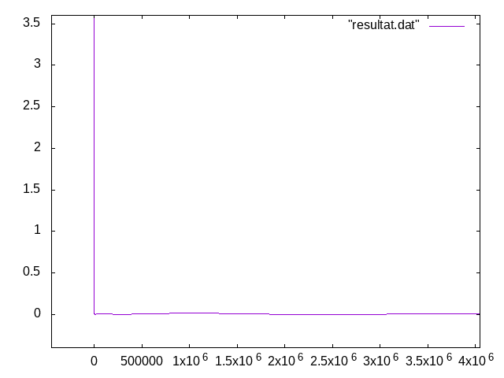

#   Performances des entrées/sorties

Ce répertoire correspond aux exercices de la section
[Performances des entrées/sorties](http://www.fil.univ-lille1.fr/~hym/e/pds/tp/tdfs-perfio.html).

Vous éditerez ce fichier pour qu’il contienne un **compte-rendu du
travail effectué**. Il devra notamment contenir :

-   les résultats (connexion entre le temps d’exécution et la taille
    des buffers utilisés, notamment) que vous avez obtenus ; ces
    résultats pourront par exemple être des graphiques produits par
    `gnuplot`,
-   les conclusions que vous avez tirées de vos expériences.

**Auteurs**: Diallo Mamadou et Fungwa Moke Junior

**Travail réalisé** 
-------------------

Nous nous sommes parvenus à implémenter la  fonction **mcat** et aussi faire l'éxperimentation sur un fichier de **1Mo** avec un tampon de taille variante de **1o** à **8Mo**. 

**le  fichier test.sh**
-----------------------

Nous avons produit un script permettant de tester un fichier de 1Mo et met les resultat dans le fichier **resultat.dat**, à partir du quel il  sera possible de produire une courbe comme l'image donnée ci-desssous.
Il est aussi possible de tester sur un autre fichier de votre choix à partir d'un terminal avec les commandes:

- make
- export MCAT_BUFSIZ
- MCAT_BUFSIZ=a (a un entier que vous pouvez faire varier pour plusieurs tests)
- ./mcat-scd nom_du_fichier
- time ./mcat-scd nom_du_fichier (pour voir le temps de la copie)

Resultat d'un test avec un tampon qui varie de **1octet** à **8Mo** sur un fichier de **1Mo**
---------------------------------------------------------------------------------------------

Nous constatons que plus la taille du tampon est grande moins le temps de la copie est considerable.

