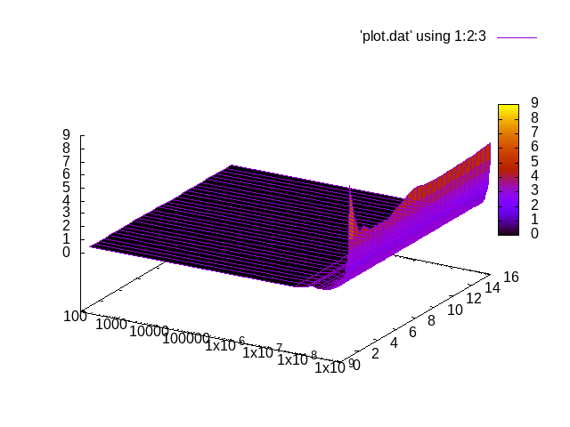

#   Processus légers

Ce dépôt correspond au TP de PDS « [Applications à des exemples
concrets](http://www.fil.univ-lille1.fr/~hym/e/pds/tp/tdth-concrets.html) ».

**AUTHOR** DIALLO *Mamadou* et FUNGWA MOKE *Junior*

### Calcul du taux G / C

`compteur-gc.c`
:   base pour le compteur de bases G et C

`aleazard.c`
:   générateur d’un « génome » aléatoire

### Travail effectué

Nous avons réaliser tout le travail demander pour le compteur `G / C`.

Le test effectuer sur une taille du genom qui varie de 10^2 à 10^9 et un nombre de threads qui varie de 2^0 à 2^5
----------------------------------------------------------------------------------

**Remarque** Le travail partagé en plusieurs threads permet bien de gagner beaucoup en temps car les threads s'éxécuterot independament et simultanement.

**Exemple**

    taille_genome        nb_threads           temps

    1000000000              16              6.310492423
    1000000000              32              2.411453224