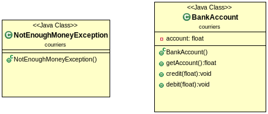
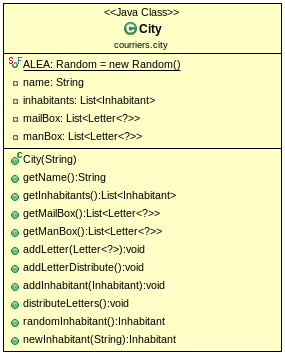
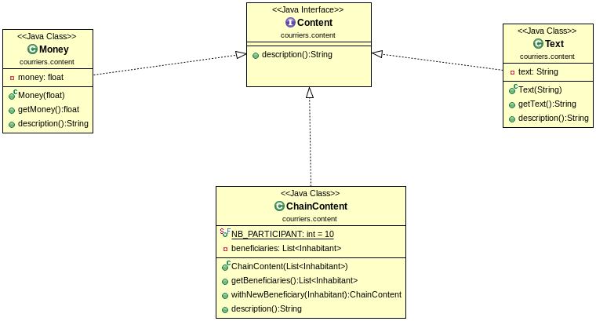
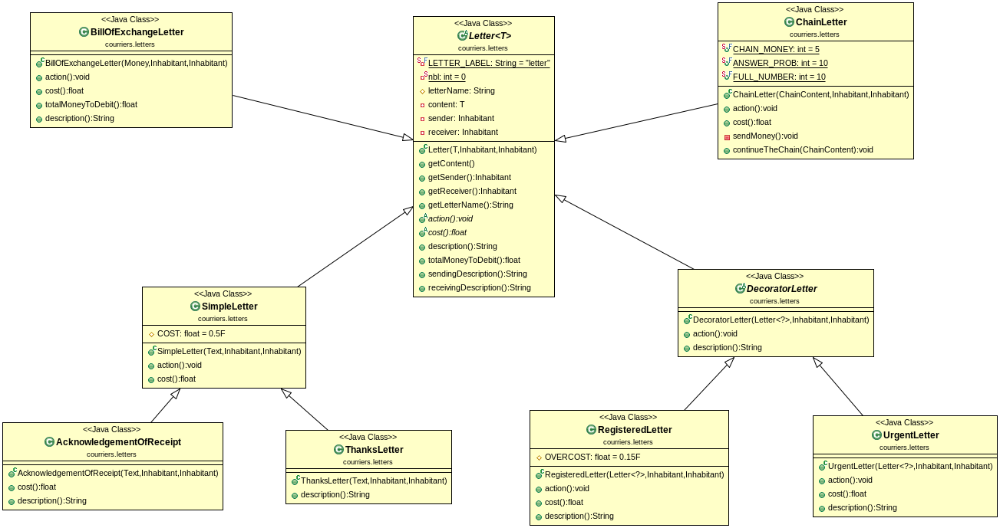
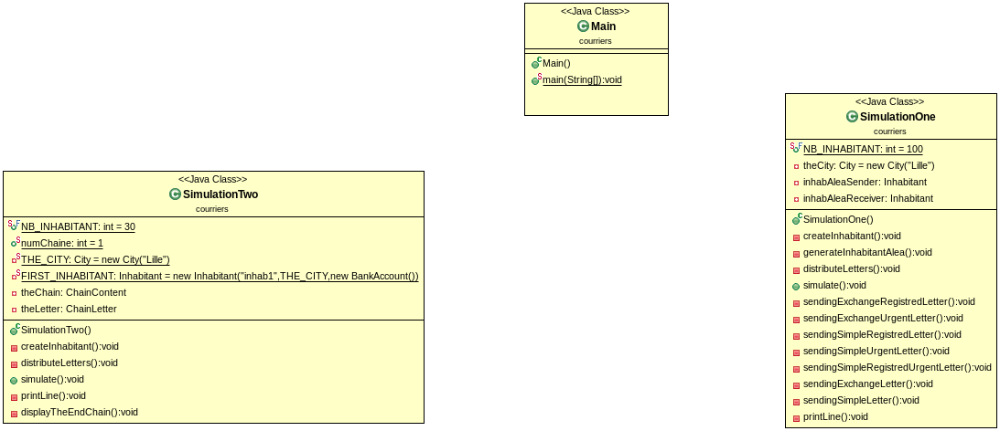
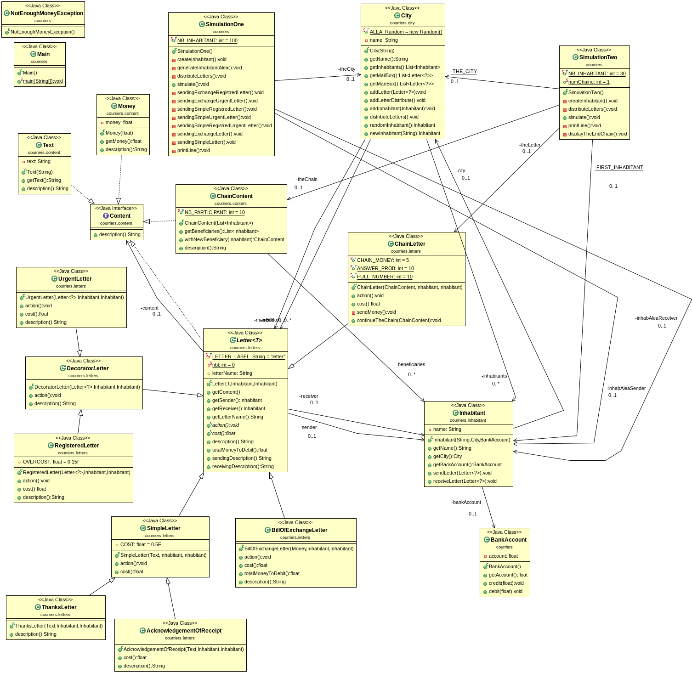

**Author**: *DIALLO Mamadou & FUNGWA MOKE Junior*
-------------------------------------------------

**PROJECT**: *Courriers*
------------------------

*Présentation des Objectifs du projet*
--------------------------------------

Ce projet consite à réaliser une conception des courriers de l'envoie à la reception. Un courrier peut être `simple` contenant que du text, une `letter d'echange` contenant de l'argent qui peuvent tous être `recomandés` et ou `urgents` dont l'action à la reception et le coût varient d'un type de courrier à un autre.

Pour réaliser cette conception nous avons utiliser differentes théories vues en cours à savoir l'Abstraction, le factoring de code en utilisant des `interfaces` voir des classes `abstractraites` si necessaires ou des methodes en `private` permettantes de decomposées les tâches d'une méthode donnée que vous pouvez retrouver très facilement dans les classes **SimulationOne** et **SimulationTwo**. Nous avons tout de même utliser les designes paternes **decorator** pour les courriers `urgent` et `recommandé`, **Strategy** qui apparait pratiquement par tout comme par exemple le fait d'avoir un attribut de type `Content` dans une`Letter` et le **Template method**.

*Récuperer le projet*
---------------------

Taper la commande :
		 
		git clone https://gitlab-etu.fil.univ-lille1.fr/diallom/diallo-fungwa-coo-tp0.git

Puis placez vous à la racine du projet pour la suite `TP_courriers`.

Compiler et exécuter le projet avec le `Makefile` mise en place
---------------------------------------------------------------

* **make comp**  : Pour compiler le projet.
* **make doc**   : Pour générer la documentation.
* **make**       : Pour faire les deux en même temps.
* **make sim1**  : Exécute la première simulation et voir sur place le contenu.
* **make sim2**  : Exécute la seconde simulation et voir sur place le contenu.

Comme cette seconde simulation peut des fois être longue donc avec les commandes qui suiveront il est possible de redriger le contenue dans un fichier et afficher quelques lignes à partir du début et quelques ligne depuis la fin du fichier.

*NB:* Pensez à faire la deuxième simulation plusieurs fois car la chaine obtenue n'est souvent pas longue dû au fait que la probabilité de reponse est de `15%`
* **make cons2** : Exécute le projet et le contenue est redirigé directement dans un fichier `sim2.txt` vous pouvez voir son existance avec `ls -l`
* **make head**	 : Affiche les 30 prémières lignes du fichier `sim2.txt`.
* **make tail**  : Affiche les 30 dernières lignes du fichier `sim2.txt`.
* **make clean** : Supprime tout ce que l'on a produit précedement.	 

*Compiler le projet*
--------------------

Pour  compiler le projet, depuis la racine du projet éxecuter la commande:
		
			“mvn package”

*Générer La Documentation*
--------------------------

Pour  générer la documentation  de toutes les classes, depuis la racine du projet éxecuter la commande:
		
			“mvn javadoc:javadoc”

Pour visualiser la documentation placez vous dans le répertoire **target/docs** .

**NB** : Le plugin donné sur le semainier ne fonctionnait pas chez nous, nous avons trouvé un autre en ligne pour l'inserer dans le *pom.xml* si vous rencontrez le même problème vous pouvez consulter le *pom.xml* pour decommenter l'un et commenter l'autre.

*Produire l'archive exécutable et l'exécuter*
---------------------------------------------

Avec la commande **mvn package** l'exécutable est automatiquement produit et pour l'exécuter taper les commandes suivantes:

* Pour la premère simulation avec les courriers `simple`, `echange`,`recommandé`,`urgent`,`accusé de reception` et `remerciement`

			“java -jar target/TP_courriers-1.0-SNAPSHOT.jar”

* Pour la seconde simulation avec le courriers de `chaine` utliser la commande:

			“java -jar target/TP_courriers-1.0-SNAPSHOT.jar 2”

**NB** : Le **2** permet l'exécution du `jar` avec la deuxième simulation et par defaut il s'exécute avec la première.

*Illustration de la coception faite avec les diagramme UML*
-----------------------------------------------------------

*************************************************************************************
* **Le compte bancaire d'un habitant** 

Le compte d'un habitant debité suite à l'envoie d'un courrier et credité lors de la réception d'un courrier d'echange et une classe d'exeption `NotEnoughMoneyException` est mise en place.

*************************************************************************************

*************************************************************************************
* **La ville**

Une ville possède une boîte aux lettre qui peut être rempli par les habitants et vider par le distributeur de courriers.

*************************************************************************************

*************************************************************************************
* **Le contenu de chaque type de courrier**

Nous disposons de trois types de contenus **Text** pour les courriers `simple`, **Money** pour les courriers `d'échange` et **ChainContent** pour les courriers de `chaine`.

*************************************************************************************

*************************************************************************************
* **Les differents types de courriers**

La classe **Letter** est une classe paramétrée dont le type est `Content` à noté qu'un courrier lui même peut-être considéré comme un contenu dans le cas où celui-ci est envoyé en recommandé ou urgent (design patterne `decorator`).

*************************************************************************************

*************************************************************************************
* **Le Main avec les deux simulations faites**

La prémière simlation est pour tout type de courriers autre que les courriers de chaines et la seconde est pour ces derniers et le Main est pour les deux.
Vous remarquerez l'existence de plusieurs méthodes en `private` celles-ci repésentent une factorisation de la methode **similate** pour faciliter sa lisibilité et sa comprehension.

*************************************************************************************
* **Une vision de l'ensemble des classes** 

