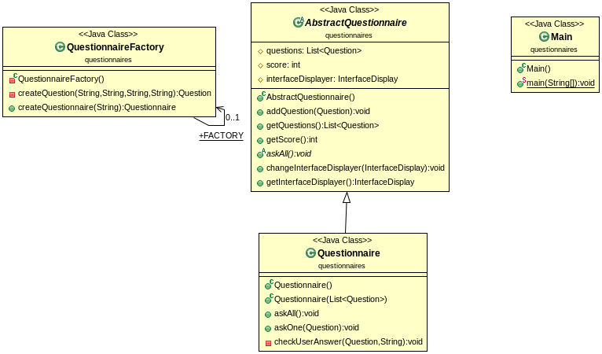
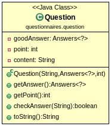
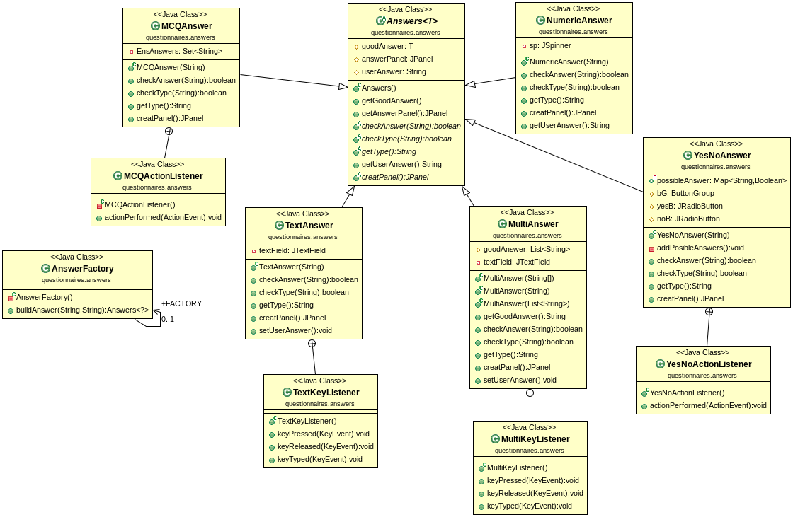
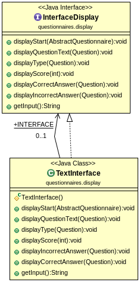
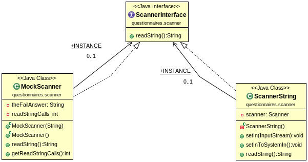
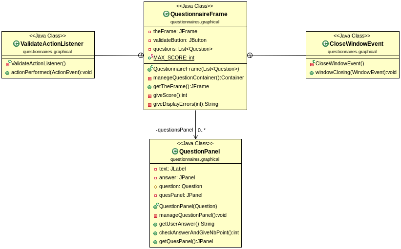
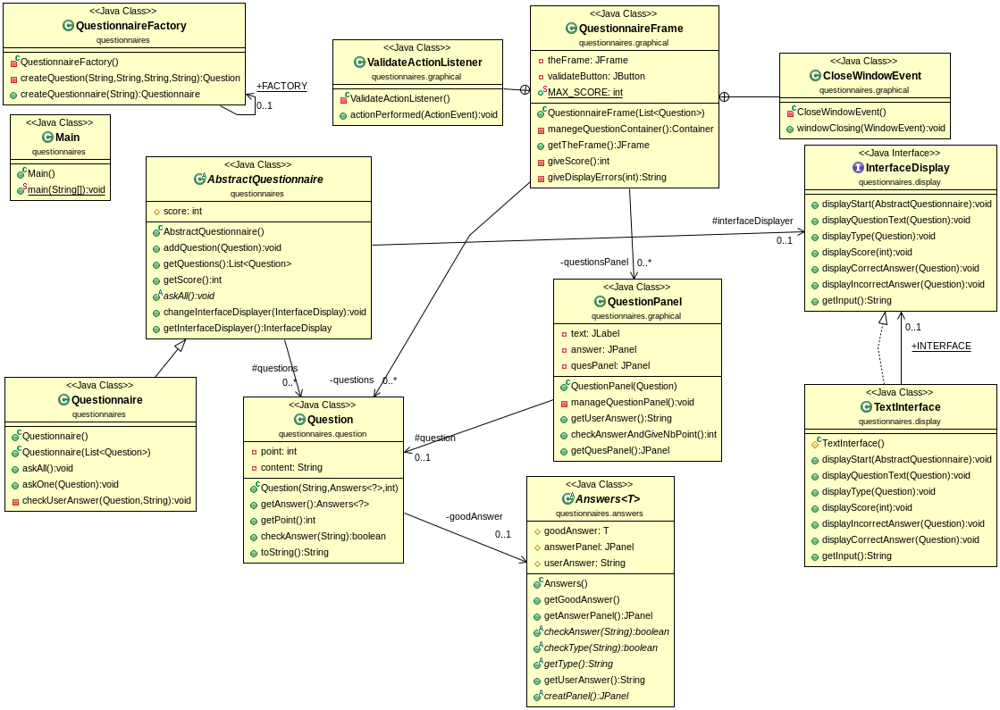

**Author**: *DIALLO Mamadou & FUNGWA MOKE Junior*
-------------------------------------------------

**PROJECT**: *Questionnaire*
------------------------

*Présentation des Objectifs du projet*
--------------------------------------

Ce projet consiste à réaliser un questionnaire avec différents types de reponses possibles à savoir une reponse `text`, `nombre`, `Oui/Non`, `choix multiple` et `QCM`.

Pour réaliser cette conception nous avons utiliser differentes théories vues en cours à savoir l'Abstraction, le factoring de code en utilisant des `interfaces` voir des classes `abstractraites` si necessaires ou des methodes en `private` permettantes de decomposées les tâches d'une méthode donnée que vous pouvez retrouver très facilement dans les differentes classes. Nous avons tout de même utliser les designes paternes **Strategy**, **Template method**, **Factory method** et **Singleton**.

*Récuperer le projet*
---------------------

Taper la commande :
		 
		git clone https://gitlab-etu.fil.univ-lille1.fr/diallom/diallo-fungwa-coo-tp0.git

Puis placez vous à la racine du projet pour la suite `TP_questionnaires`.

Compiler et exécuter le projet avec le `Makefile` mise en place
---------------------------------------------------------------

* **make comp**  : Pour compiler le projet.
* **make doc**   : Pour générer la documentation.
* **make**       : Pour faire les deux en même temps.
* **make quiz1**  : Exécute la première version le mode textuel.
* **make quiz2**  : Exécute la seconde version le mode graphique.
* **make clean** : Supprime tout ce que l'on a produit précedement.	

*Compiler le projet manuellement* 
---------------------------------

Pour  compiler le projet, depuis la racine du projet éxecuter la commande:
		
			“mvn package”

*Générer La Documentation*
--------------------------

Pour  générer la documentation  de toutes les classes, depuis la racine du projet éxecuter la commande:
		
			“mvn javadoc:javadoc”

Pour visualiser la documentation placez vous dans le répertoire **target/docs** .

**NB** : Le plugin donné sur le semainier ne fonctionnait pas chez nous, nous avons trouvé un autre en ligne pour l'inserer dans le *pom.xml* si vous rencontrez le même problème vous pouvez consulter le *pom.xml* pour decommenter l'un et commenter l'autre.

*Produire l'archive exécutable et l'exécuter*
---------------------------------------------

Avec la commande **mvn package** l'exécutable est automatiquement produit et pour l'exécuter taper les commandes suivantes:

* Pour la version textuelle:

			“java -jar target/TP3-1.0-SNAPSHOT.jar 2”

* Pour la version graphique:

			“java -jar target/TP3-1.0-SNAPSHOT.jar”

**NB** : Le **2** permet l'exécution du `jar` avec la version textuelle.

*Illustration de la coception faite avec les diagramme UML*
-----------------------------------------------------------

*************************************************************************************
* **Le questionnaire** 

Pour cette classe nous avons juger necessaire de faire une abstraction pour respecter L'`OCP` car nous voulions au début rajouter une nouvelle classe de questionnaire pour le graphique que nous avions au final enlever. 

*************************************************************************************

*************************************************************************************
* **Les questions**

*************************************************************************************

*************************************************************************************
* **Les reponses**

Pour chaque type de reponses nous avons rajouter une classe d'événement c'est à dire que nous avons intégré directement la creation des panels pour le graphique mais celles si ne sont créer que lorsque l'ont decide. l'utilisation du disagne panel **Factory method** .

*************************************************************************************

*************************************************************************************
* **Les interfaces pour l'affiche**

Ici aussi nous avons utiliser une interface pour l'ajout facile d'un autre type d'interface.

*************************************************************************************

*************************************************************************************
* **Les scaners utilisés**

Le `ScannerString` est utlisé dans la version textuelle et le `MockScanner` pour les tests.

*************************************************************************************
*************************************************************************************
* **La vesion grahique**

`QuestionnaireFrame` pour le frame qui contiendra toutes les questions, `QuestionPanel` pour les panels des questions.

*************************************************************************************

* **Une vision de l'ensemble des classes** 

